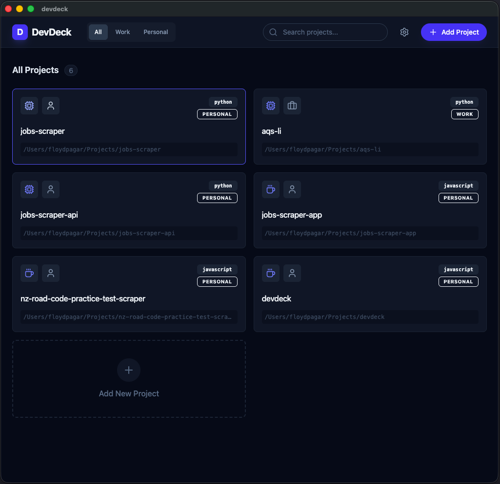
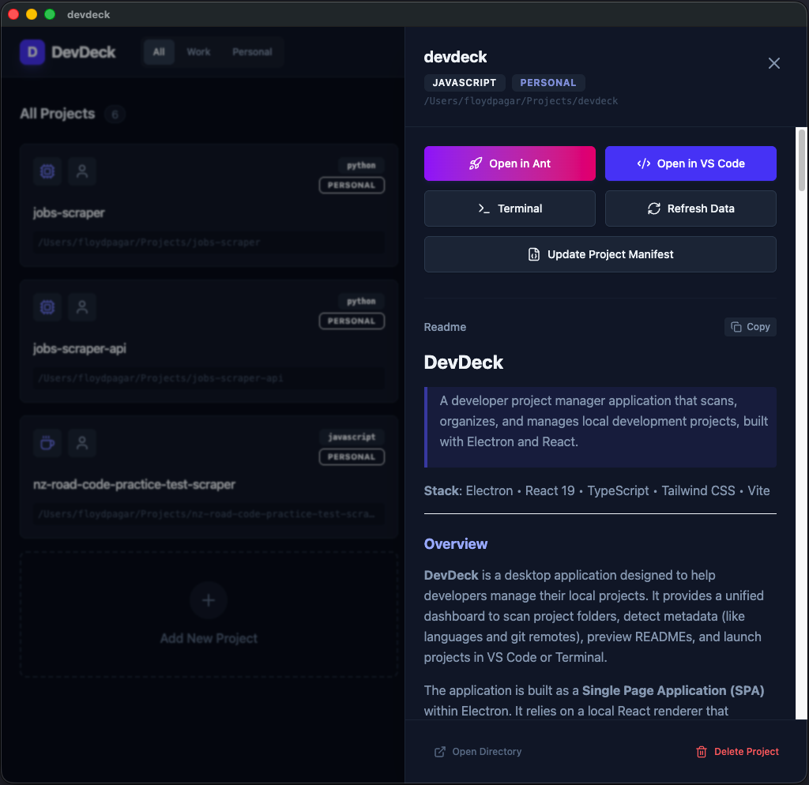
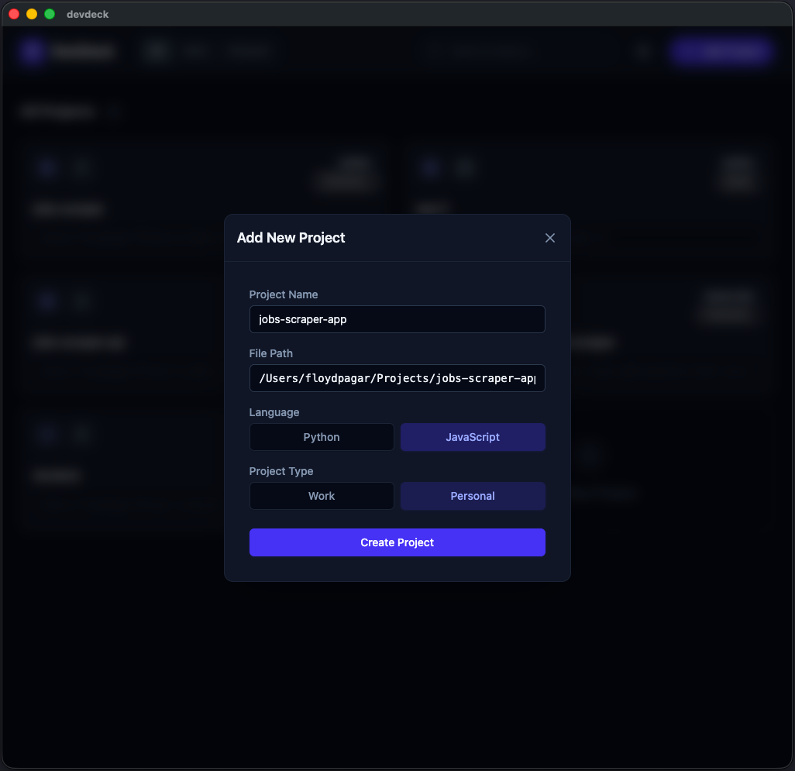

# DevDeck

[](https://github.com/virgotagle/devdeck/actions)
[](https://opensource.org/licenses/MIT)

> A desktop application that manages and tracks local development projects by scanning directories for metadata and storing them in a PostgreSQL database, designed for developers managing multiple concurrent projects.

**Built with**:     

---

## Preview

| Main Dashboard                          | Project Details                                   |
| :-------------------------------------- | :------------------------------------------------ |
|  |  |

| Database Config                         | Add Project                                 |
| :-------------------------------------- | :------------------------------------------ |
|  |  |

---

## Overview

**DevDeck** solves the challenge of organizing and quickly accessing multiple local development projects. Instead of traversing the file system or relying on shell history, DevDeck provides a centralized dashboard to view project summaries, READMEs, and Git configurations.

The system implements an **Electron + React** architecture, where the and main process handles secure database persistence (PostgreSQL) and filesystem operations, while the renderer process provides a modern, responsive UI.

### Key Decisions

- **PostgreSQL Persistence**: Chosen over simpler local stores (like SQLite) to support robust querying and potentially shared/synced project databases in the future.
- **IPC-Driven Architecture**: All sensitive operations (DB, shell, FS) are encapsulated in the main process and exposed via a safe preload bridge.
- **Tailwind CSS**: Used for rapid, consistent styling of the "Dark Mode" aesthetic.

---

## Features

### Core

- ✅ **Project Scanning**: Automatically detects project names, README content, and Git remotes from a selected folder.
- ✅ **Centralized Dashboard**: View all tracked projects in a single, filterable list.
- ✅ **Rich Markdown Preview**: Integrated project drawer for viewing and editing READMEs with full Markdown support.
- ✅ **Database Configuration**: Dynamic configuration of PostgreSQL connection with encrypted password storage.

### Data & Shell

- ✅ **PostgreSQL Integration**: Persistent storage of project metadata.
- ✅ **Git Remote Detection**: Automatic extraction of remote URLs to link directly to repositories.
- ✅ **Shell Integration**: Open project paths directly in the system file explorer or terminal.

### Operations

- ✅ **CI/CD**: Automated linting, type-checking, and build verification via GitHub Actions.
- ✅ **Structured Logging**: Persistent application logging via `electron-log`.

---

## Architecture

### Project Structure

```text
devdeck/
├── src/
│   ├── main/           # Electron main process (DB, IPC handlers, Logic)
│   │   ├── db.ts       # PostgreSQL connection & schema management
│   │   ├── handlers/   # IPC communication controllers
│   │   └── services/   # Business logic (project scanning)
│   ├── preload/        # Context-isolated bridge between Main and Renderer
│   └── renderer/       # React frontend application
│       ├── src/
│       │   ├── components/ # UI components (Modals, Drawers, Lists)
│       │   ├── hooks/      # Custom React hooks (Data fetching, Filtering)
│       │   └── types/      # Shared TypeScript interfaces
├── resources/          # App icons and static assets
└── tests/              # E2E and unit test suites
```

### Core Components

| Component          | Location                                                                                          | Responsibility                              |
| :----------------- | :------------------------------------------------------------------------------------------------ | :------------------------------------------ |
| `initDB`           | [db.ts](file:///Users/floydpagar/Projects/devdeck/src/main/db.ts)                                 | Schema initialization and pool management.  |
| `registerHandlers` | [handlers/index.ts](file:///Users/floydpagar/Projects/devdeck/src/main/handlers/index.ts)         | Orchestrates IPC routing for all features.  |
| `useProjects`      | [useProjects.ts](file:///Users/floydpagar/Projects/devdeck/src/renderer/src/hooks/useProjects.ts) | Frontend state management for project data. |

---

## Tech Stack & Patterns

### Dependencies

| Category      | Package           | Purpose                                                  |
| :------------ | :---------------- | :------------------------------------------------------- |
| **Framework** | Electron          | Desktop application wrapper.                             |
| **Frontend**  | React 19          | UI component architecture.                               |
| **Styling**   | Tailwind CSS 4    | Utility-first CSS framework.                             |
| **Database**  | PostgreSQL (`pg`) | Robust relational data storage.                          |
| **State**     | `electron-store`  | Persistent app-level settings (window state, DB config). |
| **Security**  | `safeStorage`     | Encryption for sensitive database credentials.           |

### Detected Patterns

| Pattern                | Location                  | Purpose                                              |
| :--------------------- | :------------------------ | :--------------------------------------------------- |
| **Repository**         | `src/main/db.ts`          | Abstracts raw SQL queries into reusable functions.   |
| **Controller/Handler** | `src/main/handlers/`      | Decouples IPC message handling from core logic.      |
| **Custom Hooks**       | `src/renderer/src/hooks/` | Encapsulates domain-specific state and side effects. |

---

## Getting Started

### Prerequisites

- [Node.js](https://nodejs.org/) (v20+)
- [PostgreSQL](https://www.postgresql.org/) instance

### Installation

1. Clone the repository:
   ```bash
   git clone https://github.com/virgotagle/devdeck.git
   cd devdeck
   ```
2. Install dependencies:
   ```bash
   npm install
   ```
3. Set up environment:
   Create a `.env` file or use the in-app Settings to configure your PostgreSQL credentials.

### Development

```bash
npm run dev
```

---

## Quality Assurance

| Tool           | Purpose                | Command             |
| :------------- | :--------------------- | :------------------ |
| **ESLint**     | Linting & code quality | `npm run lint`      |
| **Prettier**   | Code formatting        | `npm run format`    |
| **Vitest**     | Unit testing           | `npm run test`      |
| **Playwright** | E2E testing            | `npm run test:e2e`  |
| **TypeScript** | Static type checking   | `npm run typecheck` |

### CI Pipeline

Current pipeline executes on all pushes to `main`:

1. **Verify**: Lints, Type-checks, and runs unit tests.
2. **Build**: Ensures the application compiles on `ubuntu-latest`.
